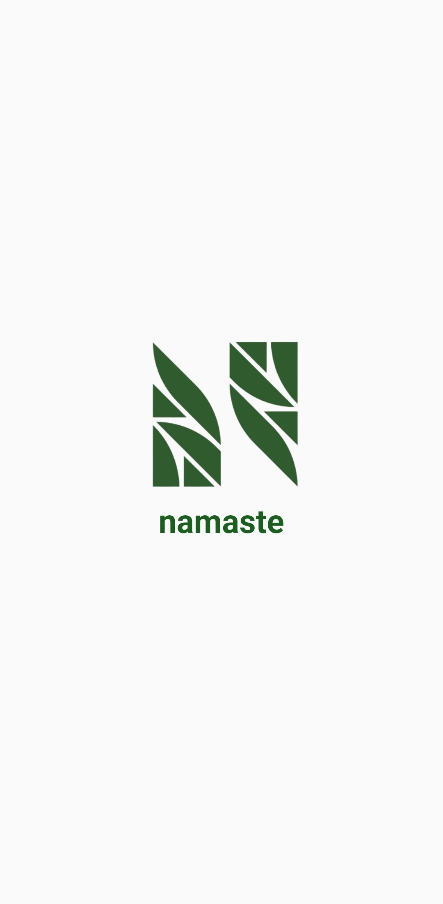
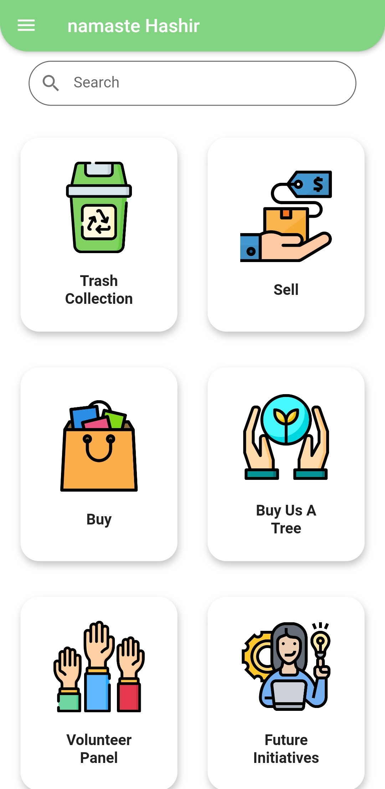
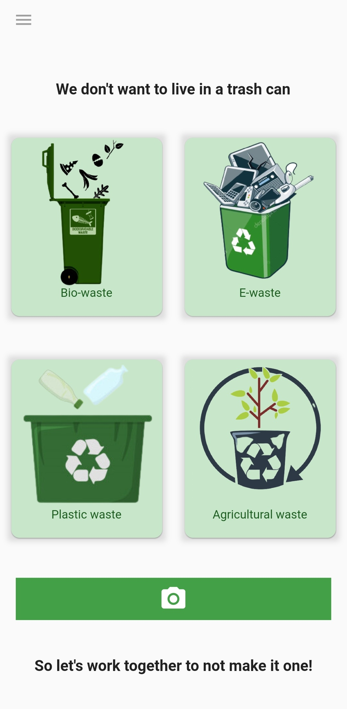
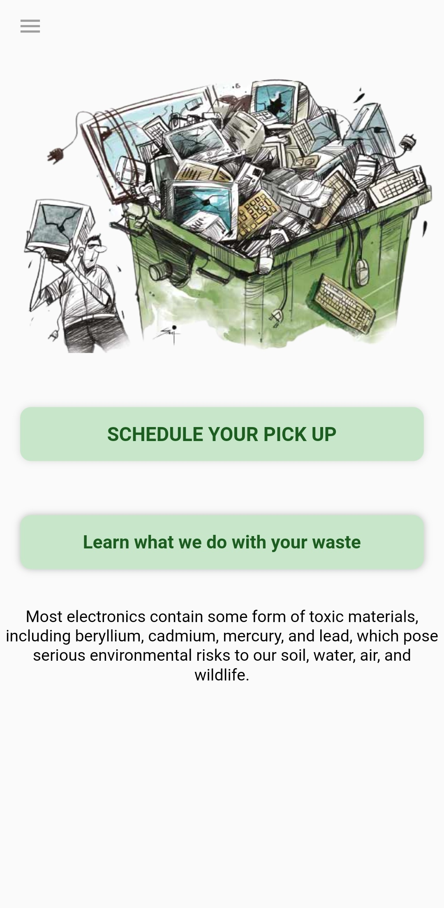
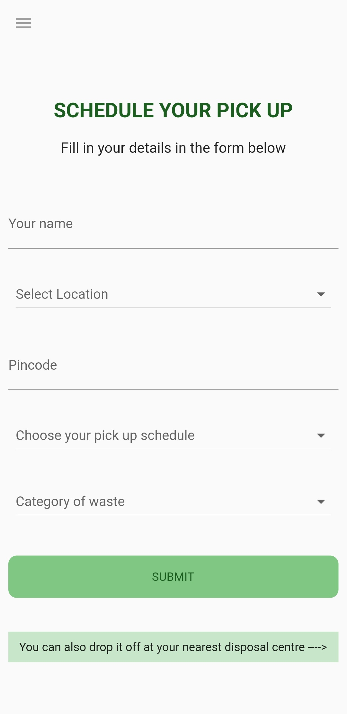
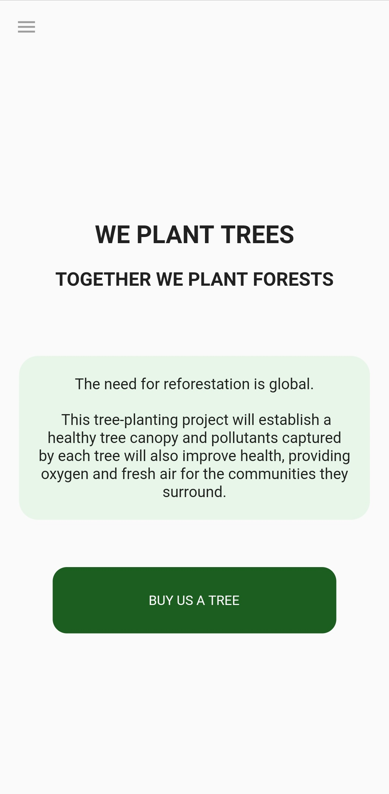
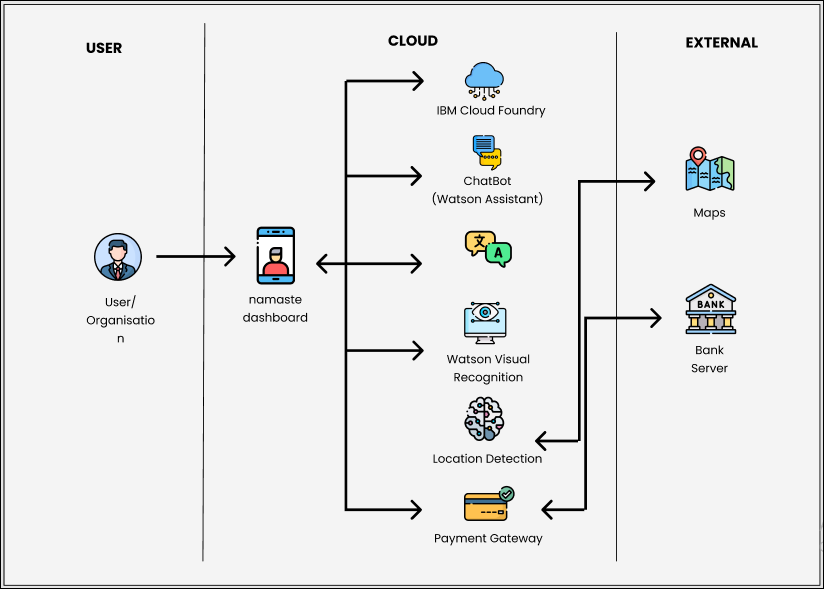
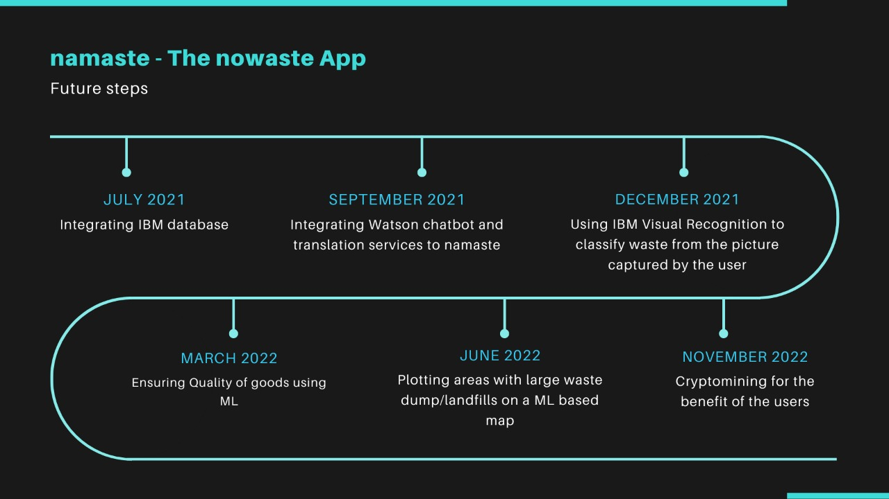

# NAMASTE - The NoWaste App

A collaborative project for a better environment, lesser climatic catastrophes and the holistic development of the society

## Short Description

### What's the problem

Millions of tons of waste is being produced on this planet every single day.Waste can be primarily classified into Bio-waste, Agricultural waste, E-waste and Plastic waste. The efficiency of the waste disposal prevailing in most countries is questionable and differs negligibly from one kind of waste to another. Consequently, it does not come as a surprise that these disposal methods affect the environment and the climate of the Earth adversely. Burning plastic, rotting biowaste, neglected electronic waste - all of them contribute to serious factors of climatic change like global warming. A proper network and method of disposal is the need of the hour and any instance of neglect would lead to irrepairable damage to our planet.

### How can technology help?

Given the advancements in the field of technology, waste disposal has to be made effective using the networking capability it gives to users as well as practicing radically different waste management methods which utilises every aspect of technology ranging from a simple mobile app to artificial intelligence and machine learning.

### The idea

The idea here is to introduce people to new ways of waste disposal through an easy to use mobile app backed by IBM services like IBM Cloud, IBM Authentication, IBM Visual Recognition as well as Watson Services. The aim is to start a community for proper collection and relaying of waste from individual households, managing and disposing them off via methods beneficial to the environment and the society as a whole.

## Demo video

[Link to Demo Video](https://youtu.be/FgyJdLVYuII)

## App Screenshots


  

 



## Architecture



## Long description

### What is this project?

The project consists of several sections for managing waste efficiently.

## **Disposing waste**

The project focuses on collecting and disposing primarily 4 types of waste:

**BIO WASTE** : The biological waste collected by the community will be taken to black soldier fly farms where these flies decompose the organic matter without as much as a scratch to the environment. The black soldier fly is an insect known for its ability in decomposing of organic matter. The black soldier fly larva (BSFL) can convert manure and organic feed into nutritional meal for animals. While decomposition of the organic matter can be achieved, mass production of the BSFL can also be achieved since a single female fly can produce upto 500 eggs. The larvae known to be extremely rich in protein can be successfully used as a substitute for animal feed at prices as low as half of the cost of currently available feed. The quantity of feed needed would also drastically reduce since 5g of BSFL would compensate 10g of the ordinary food feed. The black soldier flies are found in climates similar to that found in Kerala, but are not found in any of the neighbouring states. This implies, decomposition of waste in BSF farms would mean not only ensure economical stability, but economic growth without compromising the effectiveness of the waste disposal method. Kerala can thus become a mass biowaste management hub for several states across India.

**PLASTIC WASTE** : The bulk of plastic waste collected would be used in producing commodities that are useful for the society. However, care has to be taken to not use recycled plastic for any goods that comes in close contact with people or animals. Hence, we came up with the idea of flower pots made of recycled plastic. These would be useful compared to the mudpots in the sense thatplastic pots would be more durable and manageable. They will not be brittle in contrast to their mud counterparts. Our aim is to avoid incineration of plastic as it is undoubtedly disastrous for the environment.

**AGRICULTURAL WASTE** : Agricultural waste contributes generously to the degradation of environment and thereby climatic change. If among the agricultural waste, we could procure waste that could be recycled into paper, it would prove beneficial to the nature. It would account for proper disposal of the waste AND a reduction in deforestation to make paper.

**E-WASTE** : The electronic waste collected during the process would be properly relayed to the sites disposing these wastes. As a future plan, the electronic gadgets procured can be segregated into usable and completely damaged from which the usable gadgets can be donated to people or communities who cannot afford electronic devices.

### Collecting the waste

This is where our flutter app comes in. This app allows the user to notify the women volunteer groups about the waste in their house and schedule a pick up time for the same. The users can either choose the category of waste from the options provided in the app (presently) or take a picture of the garbage after which the app will suggest the category of waste capttured(using ML) in case they do not know in which category to schedule the pick up. Each user will have an individual profile and earns points each time they dispose off waste through our app. As the points increase, they can buy eco-friendly products made by small communities at discounted rates with discounts proportional to their points.We will also be selling black soldier fly larvae to the customers through the app. This would provide small craftsmen communities to increase their business. The women volunteer groups will be paid cash for collecting the waste at regular interval and bringing them to us from where we would work on disposing off all the waste properly and as planned. This would also be a step towards empowering the women communities.

### Result

Thus, our project brings together efficient ways of disposal as well as proper collection of waste in the ultimate aim to reduce adverse effects to the environment.

[UI MODEL](https://youtu.be/m4c15XxZaDw)

## Project Roadmap



The project currently does the following:

1. Allows users to schedule a pickup date
2. Manages different kinds of waste efficiently
3. Provides livelihood to various women and craftsmen communities

Future steps include:

1. Ensuring better quality products by checking the batch of goods as a whole using machine learning
2. Integrating IBM databse and Watson translation, chatbot services to namaste app.
3. Utilising IBM visual recognition services to help identify the type of waste from an image captured by the user.
4. Enabling cryptomining in the background of our app to attract young people and this crypto rewards could be redeemed while purchasing from our app
5. Plotting areas with large waste dump/landfills on a ML based map which classifies the image inputs from user

## Built with

- Flutter
- IBM Cloud Foundry

## How to Run

**Step 1:**

Download or clone this repo by using the link below:

```
https://github.com/Rosemary-benny/NAMASTE.git
```

**Step 2:**

Go to project root and execute the following command in console to get the required dependencies:

```
flutter pub get
```

**Step 3:**

Run main.dart file or usethe following command

```
flutter run
```

## Contributors

[Rosemary Benny](https://github.com/Rosemary-benny)

[Aishwarya Prabhu](https://github.com/Aishwarya-S-Prabhu)

[Rishika Raveendran](https://github.com/Rishika-Raveendran)

[Navneeth Variar](https://github.com/navneethvariar14)

[Muhammed Hashir PM](https://github.com/hashirpm)
